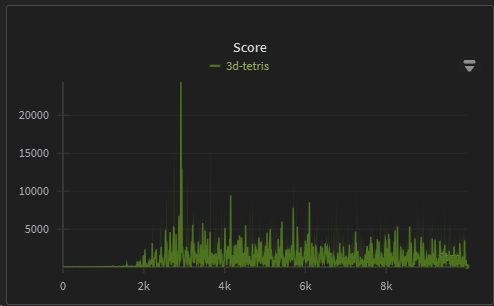
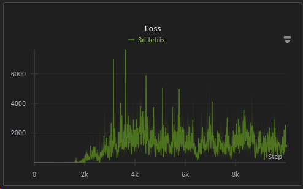
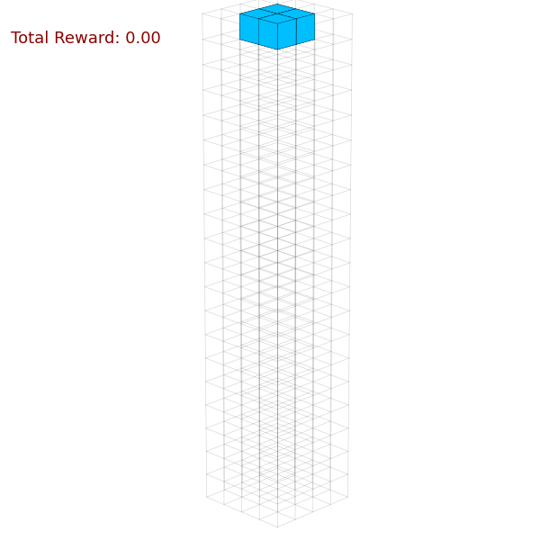
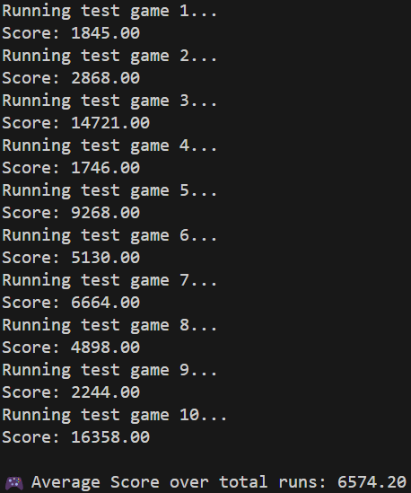

# 3D Tetris with Deep Q-Network (DQN)

A reinforcement learning project using a DQN agent to play a custom 3D Tetris environment. This repository includes both training and testing scripts, along with visualization tools for learning progress and gameplay.

## 📋 Table of Contents

- [Introduction](#introduction)  
- [Features](#features)  
- [Installation](#installation)  
- [Usage](#usage)  
- [Training Curve](#training-curve)  
- [Demo Video](#demo-video)  
- [License](#license)  

---

## 🧩 Introduction

This project implements a Deep Q-Network (DQN) agent to learn and play a 3D version of Tetris. It provides scripts for training the model from scratch and testing a trained agent in the 3D Tetris environment.

---

## 🚀 Features

- Deep Q-Network agent with epsilon-greedy exploration
- Custom 3D Tetris environment
- Training and testing pipelines
- Visualization of training performance
- Video recording of agent gameplay

---

## 💻 Installation

```bash
git clone https://github.com/your-username/3d-tetris-dqn.git
cd 3d-tetris-dqn

# Create virtual environment
conda create --name tetris python=3.8
conda activate tetris

# Install dependencies
pip install -r requirements.txt

```

---

## ⚙️ Usage

- Training the DQN agent
```bash
python train.py
```

- Testing the DQN agent for n runs. If you want to record the video, It is recommand to shorten the recording epochs, or it may cost lots of time.
```bash
python test.py
```

---

## 📈 Training Curve

- A graph showing episode rewards over training time.



- A graph showing loss over training time.



---

## 🎥 Demo Video

- Early-training gameplay results video.



---

## Inference


---

## 📄 License

This project is licensed under the MIT License.  
See the [LICENSE](LICENSE) file for full details.

---

### 📚 Acknowledgements

This project is inspired by and partially based on the work of [Viet Nguyen](https://github.com/uvipen) (2020).  
Original project: [uvipen/Tetris-DQN](https://github.com/uvipen/Tetris-DQN)  
Licensed under the MIT License.